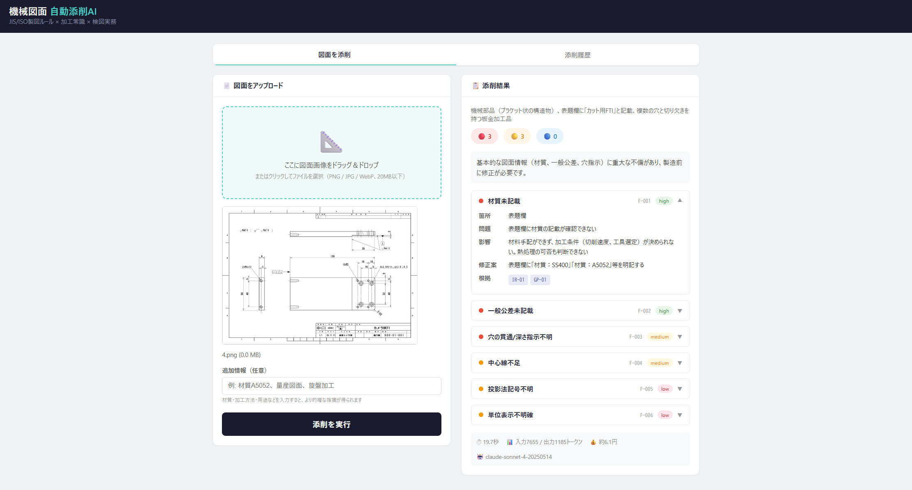

# 図検 AI（zuken-ai）

**機械図面を自動で添削するAIツール**

図面画像をアップロードするだけで、JIS/ISO製図ルール・加工常識・検図実務の観点から不備を指摘し、コスト削減・加工性改善の提案まで行います。

町工場が発注者に「この図面、ここを直せばもっと安く・早く作れますよ」とフィードバックするための武器です。

---

> **English Summary**
>
> **zuken-ai** is an AI-powered mechanical drawing review tool. Upload a drawing image (PNG/JPG) and get instant feedback on drafting rule violations (JIS/ISO), machining feasibility issues, and cost reduction suggestions — all from a machinist's perspective. Built with Claude API (Vision) and a 90-chunk knowledge base. Free and open source (MIT License).

---

## デモ



*図面をドラッグ＆ドロップ → 添削結果が即表示（error / warning / suggestion）*

## 特徴

- **90件の知識ベース**で製図ルール・加工常識・コスト提案をカバー
  - 製図原則（JIS/ISO）: 20件
  - 加工常識: 20件
  - 検図指摘パターン: 20件
  - コスト・加工性提案（DFM/DFA）: 30件
- **画像入力**（PNG/JPG/WebP）→ Claude Vision APIが図面を読み取り
- **構造化された出力**（error/warning/suggestion + 根拠ルールID）
- **Web UI**（Flask）：ドラッグ＆ドロップでブラウザから操作
- **CLI**も対応：コマンドラインからバッチ処理可能
- **添削履歴**を自動保存（results/フォルダにJSON）
- **1回あたり約10円**（Claude Sonnet使用時）

## MEVIYとの違い

| | MEVIY（ミスミ） | 図検 AI |
|---|---|---|
| 目的 | 部品の見積もり・発注 | **図面の不備指摘 + コスト提案** |
| 入力 | 3D CADデータ | 2D図面画像（PNG/JPG） |
| 出力 | 価格・納期 | **指摘一覧 + 修正案 + 根拠** |
| ユーザー | 発注する設計者 | **図面を受け取る加工側（町工場）** |
| 提案力 | 製造可否のみ | **「こう変えればコスト削減」まで提案** |

## クイックスタート（Windows）

### 必要なもの

- Python 3.8以上
- Claude APIキー（[console.anthropic.com](https://console.anthropic.com) で取得、$5で約500枚分）

### 手順

```
1. このリポジトリをダウンロードまたは git clone
   git clone https://github.com/あなたのユーザー名/zuken-ai.git

2. フォルダに移動
   cd zuken-ai

3. パッケージインストール
   pip install flask anthropic

4. APIキー設定（PowerShell）
   $env:ANTHROPIC_API_KEY = "sk-ant-..."

   コマンドプロンプトの場合:
   set ANTHROPIC_API_KEY=sk-ant-...

5. 起動
   python app.py

6. ブラウザで http://localhost:5000 を開く

7. 図面画像をドラッグ＆ドロップ → 「添削を実行」
```

または `start.bat` をダブルクリック（初回は自動でパッケージインストール）。

### CLI（コマンドライン）で使う場合

```powershell
python review_cli.py drawing.png
python review_cli.py drawing.png --format json --output result.json
python review_cli.py drawing.png --context "材質A5052、量産図面"
```

## ファイル構成

```
zuken-ai/
├── README.md                 # このファイル
├── LICENSE                   # MIT License
├── requirements.txt          # Pythonパッケージ
├── start.bat                 # Windows用起動スクリプト
├── app.py                    # Flask Web UI
├── review_cli.py             # CLIツール
├── system_prompt.py          # システムプロンプト生成
├── knowledge_base.json       # 知識ベース（90チャンク）
├── templates/
│   └── index.html            # Web UI画面
├── docs/
│   └── README_en.md          # English README
├── uploads/                  # アップロード画像（自動作成）
└── results/                  # 添削結果JSON（自動作成）
```

## 知識ベースの構成

`knowledge_base.json` に90件の知識チャンクが格納されています。

### Level 1: 製図ルール・検図指摘（60件）

| レイヤー | 件数 | 内容 |
|---------|------|------|
| drawing_principles | 20件 | JIS/ISO製図原則（寸法、公差、表面粗さ等） |
| machining | 20件 | 加工常識（内角R、工具制約、深穴等） |
| inspection_patterns | 20件 | 検図指摘パターン（未記載、曖昧語等） |

### Level 2: コスト・加工性提案（30件）

| カテゴリ | 件数 | 内容 |
|---------|------|------|
| 公差・粗さコスト | 2件 | 過剰公差の緩和、粗さの部分指定 |
| 形状コスト | 4件 | 内角R拡大、深ポケット簡素化、角部R許容、素材最適化 |
| 材料コスト | 3件 | 材質代替、肉抜き、ネスティング |
| 工程効率 | 4件 | 工程数削減、同一面加工、寸法配置、加工基準面 |
| 標準化 | 3件 | 標準穴径、ねじ統一、共通部品流用 |
| 仕上げ | 1件 | 面取り・バリ取り明確化 |
| 構造変更 | 2件 | 溶接構造、市販品活用 |
| DFA（組立容易化） | 3件 | 部品点数削減、組立方向統一、締結簡素化 |
| DFM（製造容易化） | 2件 | 多機能統合、金型簡素化 |
| 過剰仕様 | 2件 | 不要表面処理削除、過剰安全率見直し |
| 工法転換 | 1件 | ニアネットシェイプ |
| リードタイム | 1件 | 納期短縮設計変更 |
| ねじ | 1件 | タップ深さ適正化 |

## APIコスト目安

| 項目 | トークン数 | 費用 |
|------|-----------|------|
| システムプロンプト（知識ベース込み） | 約17,000 | 約5円 |
| 図面画像 | 約1,500〜5,000 | 約1〜2円 |
| 出力（指摘JSON） | 約1,000〜2,000 | 約2〜5円 |
| **合計** | | **約8〜12円/枚** |

## カスタマイズ

### 知識チャンクの追加

`knowledge_base.json` にチャンクを追加すれば、指摘項目を増やせます。

```json
{
  "id": "CP-31",
  "layer": "cost_proposal",
  "title": "あなたの工場固有の提案",
  "category": "カテゴリ",
  "rule": "ルール文",
  "reason": "なぜ重要か",
  "fix_example": "具体的な修正案",
  "severity": "suggestion",
  "tags": ["tag1", "tag2"],
  "source": "情報源"
}
```

### 自社の加工設備に特化

工場の保有設備（旋盤の最大径、フライスのストローク等）に合わせたチャンクを追加すれば、「うちの設備ならこう作るのがベスト」という提案が可能になります。

## 今後のロードマップ

- [ ] 精度検証（実際の図面での正答率評価）
- [ ] 知識ベースの拡充（100件→200件）
- [ ] PDF図面対応（テキスト抽出 + Vision API）
- [ ] ルールエンジン（正規表現による確定的error検出）
- [ ] ベクトル検索（ChromaDB）によるRAG本格化
- [ ] ローカルLLM対応（Llama Vision等）
- [ ] 見積もり連携（コスト提案に概算金額を付与）

## コントリビューション

知識チャンクの追加・修正、バグ報告、機能提案を歓迎します。
特に **現場の加工知識に基づくチャンク追加** は大歓迎です。

1. Fork
2. ブランチ作成 (`git checkout -b feature/新しいチャンク`)
3. 変更をコミット (`git commit -m '加工提案チャンク追加'`)
4. Push (`git push origin feature/新しいチャンク`)
5. Pull Request

## ライセンス

MIT License — 自由に使用・改変・再配布できます。
## 関連記事

- [機械図面をAIで自動添削する方法｜RAGを使った開発手順](https://livemyself.com/archives/5196)
- [エンジニアがClaude APIで副業する方法｜実際に作ったツール3選と収益化のリアル](https://livemyself.com/)
